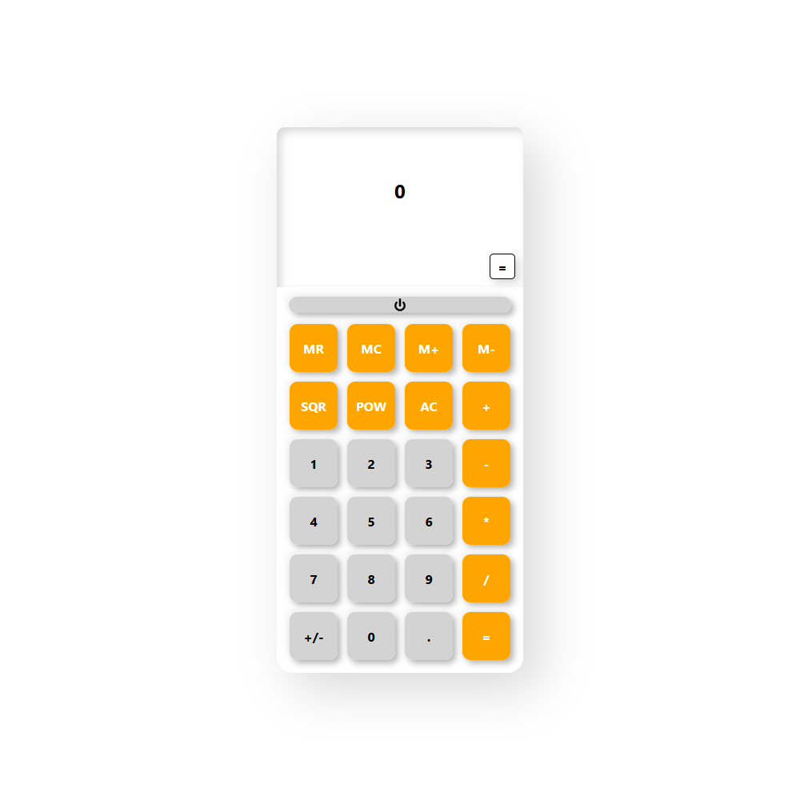

# JavaScript Calculator

<button style="border: 1px solid white; border-radius:5px; padding: 10px 20px; background-color:white;"><a href="https://connor-turlan.github.io/JSCalculator/">View the Project</a></button>

## Setup

It is recomended to use the [Live Server](https://marketplace.visualstudio.com/items?itemName=ritwickdey.LiveServer) extention within VS Code.

However, this application can also run as is, openning the index.html file in your web browser.

## MVP

Create a calculator to be rendered to the html page

1. it should have number keys from 0 to 9
2. It should have operator keys (+, -, /, \*, =)
3. It should have a display rendering the current calculation in a box at the top
4. It should also have a “.” key
5. Should render the current calculation in a box at the top (calculator display)
6. It should handle decimals
7. It doesn’t need to support orders of operation
8. It should not use `eval()` or `Function()` constructor

## Goals

The main goal of this project was to create a calculator that was visually similar to an ordinary desktop calculator.

Including all the functions outlined in the original MVP, I also wanted to include a memory function to increase the usefulness of the calculator. This included:

-   add and subtract buttons - to modify the memory.
-   recall - to return the value stored in memory.
-   clear - the reset the calculator's memory.

Beyond the original scope, additional functions added were:

-   A power button to toggle the screen, and all memory state in the calculator.
-   Power of, and Square functions.
-   Adding comma formatting to groups of three digits. e.g. 1,234

## Known Issues

-   Adding trailing zeroes after a decimal point will not render to the screen.
    -   Caused by how commas are inserted for groups of thousands.
        -   Potentially fix with bespoke function?

## Retrospective

-   Things I'd differently next time

    -   What? Why? How?

If I was to do this project again in the future, some change to make would be:

-   Make the class more modular, allow it to be bound and create a

-   What did you struggle with?

    -   What? Why? How?

## Future Plans

-   Future goals / changes

## Contributions

-   Licensing Details

-   Contribution

-   Further details, related projects, reimplementations
